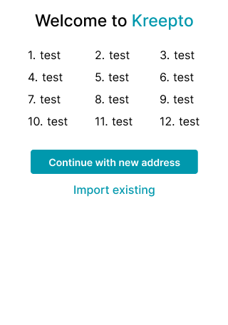
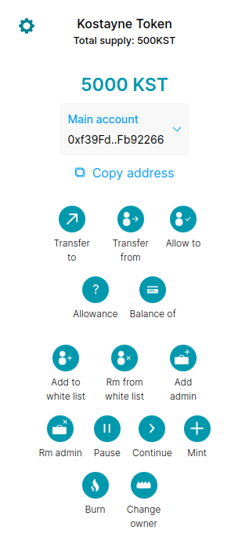

# ERC20 Token with wallet
Here is a custom ERC20 token that you can modify as you want, 
also the project contains a frontend wallet for it.




Stack: hardhat, ethers, svelte.

Features:
- Admins list :white_check_mark:
- White list :white_check_mark:
- Pause / unpause :white_check_mark:
- Transfer to :white_check_mark:
- Transfer from, approve :white_check_mark:
- Total supply, balance of :white_check_mark:
- Symbol, name :white_check_mark:

## Docker :whale:

### Compose
Run all services. The wallet will be available on 127.0.0.1:80.
```
docker compose up
```

### Docker CLI
Build an image
```
# hardhat node example
docker build -t erc20token .
```

Run the image
```
# hardhat node example
docker run -d -p 80:80 erc20token
```

## Local dev
Run a hardhat node
```
npm run node
```

Deploy the contract to the node
```
# in different terminal
npm run deploy
```

Run the frontend
```
cd frontend
npm run dev
```

Test the contract
```
npm run test
```